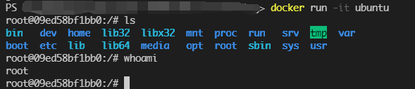
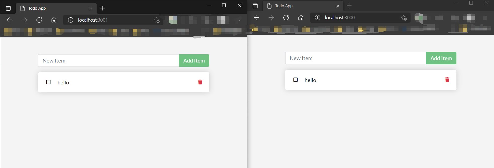
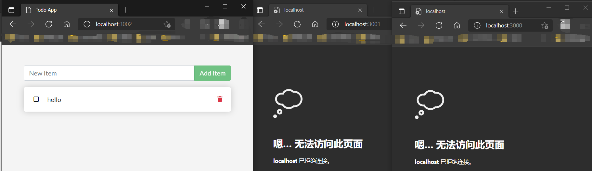
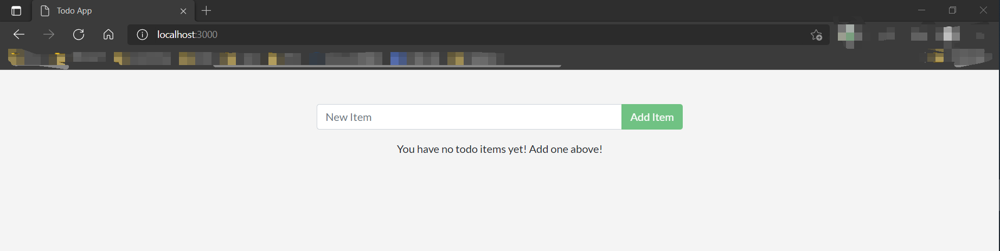
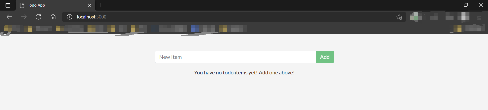
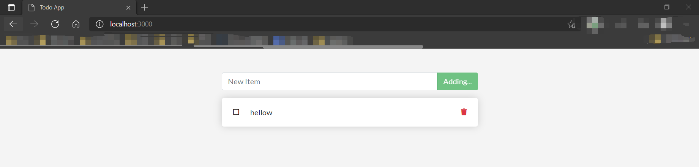

# Docker学习笔记（二）

暑期加入了沃天宇老师的实验室进行暑期的实习。在正式开始工作之前，师兄先让我了解一下技术栈，需要了解的有docker、k8s、springboot、springcloud。

仅以一系列博客记录一下自己学习的笔记。更多内容见[Github](https://github.com/SnowPhoenix0105/BackEndLearning)


2021/7/6


## 容器的文件系统

容器间的文件是相互隔离的，即使它们都使用同一个镜像。

### 实验

```powershell
docker run -d ubuntu bash -c "shuf -i 1-10000 -n 1 -o /data.txt && tail -f /dev/null"
```

* `-d`选项表示detached模式，这个前面已经了解了；
* `ubuntu`应当是指定使用的镜像，因为输入指令之后我们就可以看到docker从中央仓库pull下来了ubuntu的镜像；
* `bash`我猜测是指定了运行的程序，bash体验确实优于sh；
* `-c` 后面指定了一个运行的命令，我猜测`c`是`command`的缩写，而后面的语句的意思应该是向`/data.txt`写入一个1~10000的随机数，然后不断向控制台输出`/dev/null`中新加入的内容；

通过`docker ps`拿到刚刚启动的容器的id后，我们通过以下指令可以拿到`/data.txt`中的随机数：

```powershell
docker exec <CONTAINER> cat /data.txt
```

之后，我们再启动一个镜像：

```powershell
docker run -it ubuntu ls /
```

* `-it`应当是一个区别于`-d`的选项，我们看到这条语句运行完成之后直接在console显示了结果；
* `ls /`应当是要在这个容器内执行的程序，因为我们可以看到这个语句完成之后打印了一个目录的列表；

这里我们也能看到在上一个run指令中，`-c`其实是传给`bash`的参数，而不是`docker run`的参数。

从这里的结果可以看出，新创建的镜像中没有第一个镜像中的`/data.txt`，这就证明了这两个使用相同镜像的容器中的文件系统是相互隔离的，它们互相无法访问到彼此的文件。

#### 实验后的小探究

实验结束后，使用`docker ps`指令可以发现，第一个启动的容器并没有停止，而第二个容器已经停止了，通过`docker ps -a`可以看到被停止的容器。

仔细观察两次启动容器的区别，可以发现，第一个容器中，特地使用了`tail -f`，这个指令会进入一个有死循环的程序，只要不主动退出，就不会完成，而第二个容器中使用的是`ls`，当打印完目录的内容后，就结束了，此时容器就停止了。

为了探究`-it`的作用，先通过`docker run --help`得知，`-i`的作用是保持`stdin`为开启状态，即使没有attached，而`-t`是打开一个虚拟终端，二者通常一起使用。

直接运行

```powershell
docker run -it ubuntu
docker run -it ubuntu bash
```

二者似乎会产生相同的效果，我们可以看到如下效果：



我们进入了一个终端，并且打开另一个Powershell终端输入`docker ps`，可以发现这个容器并没有停止，而是处于运行的状态，并且这个bash前面`root@xxxxxx`中的`xxxxx`就是这个容器的ID。

此外，我们还可以发现，就算启动时，我们没有指定`bash`这个参数，`docker ps`中的`COMMAND`一列，还是会显示为`bash`，看来bash很可能是一个默认的行为，猜测可能跟ubuntu镜像的Dockerfile相关。

我还对`docker exec`指令试验了`-it`的效果：

```powershell
docker exec -it <CONTAINER> bash
```

这里的`bash`就不能省略了，否则会报错。我输入了第一个容器的id，通过`cat /data.txt`仍旧可以拿出之前获得的那个随机数。而如果输入了一个已经停止的容器的id，就会报错，exec指令只能用于访问一个正在运行的指令，而不能访问一个已经停止的容器。

从上述的探究来看，一个容器如果其指令全部执行完毕，就会停止，此时无法在通过`docker exec`来进入容器进行操作；倘若我们想要通过`docker exec -it`进入容器操作，我们就需要让容器进入一个不会退出的程序来*保活*。不过可能有一些指令能够让一个已经停止的容器恢复运行。

实验结束之后，我们需要清理一下这些容器：

```powershell
docker rm -f $(docker ps -aq)
```

这个是搜索来的指令，其中`docker rm -f`我们已经熟悉了，它表示删除一个容器，如果容器正在运行，就会停止并删除，而后面的部分`docker ps -aq`中，`-q`的作用是只保留id，这样它的结果就是一串`CONTAINER_ID`，作为`docker rm -f`的参数。


## Volumes

我也不知道该怎么翻译这个词，Edge自带的翻译将它翻译成了“卷”，我就姑且先叫它`数据卷`吧。

它的出现，就是为了解决容器间/容器-宿主机间的数据共享问题。通过容器内到宿主机的文件系统的映射，来实现数据的共享/持久化。

通过如下命令建立一个名为`todo-db`的Volume：

```powershell
docker volume create todo-db
```

然后再次启动我们之前构建好的demo的镜像：

```
docker run -dp 3000:3000 -v todo-db:/etc/todos getting-started
```

然后再在3001启动一遍：

```
docker run -dp 3001:3000 -v todo-db:/etc/todos getting-started
```

用浏览器访问3000和3001，并且在3000添加新的todo，在3001刷新一下就能发现数据同步过来了：



此后，我们停止并删除这两个容器之后，再在3002启动一个新的容器，发现这个todo还是存在的：



这里发生了什么事呢？

肯定是和`Volume`的使用相关，我们注意到我们在启动容器的指令中添加了参数`-v todo-db:/etc/todos`，该指令将容器中的`/etc/todos/`文件夹绑定到我们刚刚创建的名为`todo-db`的Volume中了，而`/etc/todos/`文件夹下正是我们启动的这个项目的sqlite数据库存放`.db`文件的目录，参见`docker\gov-sample-app\src\persistence\sqlite.js`第3行：

```javascript
const location = process.env.SQLITE_DB_LOCATION || '/etc/todos/todo.db';
```

而通过`Volume`，我们将sqlite的文件映射到了宿主机上，这样不同容器间就可以共享这个sqlite文件，并且容器被销毁后sqlite文件不会随之被销毁。

至于具体被保存在了宿主机的哪里，通过`docker volume inspect <VOLUME NAME>`来查看。注意Windows和mac中，docker都是运行在虚拟机上的，所以这里得到的并不是系统路径，而是虚拟机中的路径。

这里我使用阿里云的服务器进行实验：（删去了一些个人信息）

```powershell
snowphoenix@xxx:~$ sudo docker run -it -v test:/tmp/test ubuntu bash
Unable to find image 'ubuntu:latest' locally
latest: Pulling from library/ubuntu
c549ccf8d472: Pull complete 
Digest: sha256:aba80b77e27148d99c034a987e7da3a287ed455390352663418c0f2ed40417fe
Status: Downloaded newer image for ubuntu:latest
root@f1fd90b64c48:/# ls
bin   dev  home  lib32  libx32  mnt  proc  run   srv  tmp  var
boot  etc  lib   lib64  media   opt  root  sbin  sys  usr
root@f1fd90b64c48:/# cd tmp
root@f1fd90b64c48:/tmp# ls
test
root@f1fd90b64c48:/tmp# cd test/
root@f1fd90b64c48:/tmp/test# ls
root@f1fd90b64c48:/tmp/test# echo "123" >num
root@f1fd90b64c48:/tmp/test# cat num
123
root@f1fd90b64c48:/tmp/test# exit
exit
snowphoenix@xxx:~$ sudo docker volume inspect test
[
    {
        "CreatedAt": "2021-07-06T18:40:16+08:00",
        "Driver": "local",
        "Labels": {},
        "Mountpoint": "/var/lib/docker/volumes/test/_data",
        "Name": "test",
        "Options": {},
        "Scope": "local"
    }
]
snowphoenix@xxx:~$ sudo cat /var/lib/docker/volumes/test/_data/num
123
```

我先启动了一个ubuntu镜像，并将`/tmp/test`目录映射到名为`test`的volume中，在容器中，我们发现`/tmp/test`这个目录已经被创建好了，我在这个目录下创建一个`num`文件并写入`123`。退出容器之后，通过`docker volume inspect test`查看到了Volume的实际路径，然后打开了该路径下的`num`文件，获得了在容器中写入的`123`。


## 绑定挂载（Bind mounts）

不同于Volume，通过这种方式可以指定宿主机与容器映射的文件夹。方法就是在`-v`选项后面，使用宿主机的文件夹路径代替`Volume`名。

这种方法可以用于开发时的热更新，即在容器内运行，在容器外进行开发，并且利用开发工具让容器内运行的程序随时进行更新。

在命令行切换到`gov-sample-app`文件夹，然后输入以下命令运行之前的getting-started：

```powershell
docker run -dp 3000:3000 -w /app -v "$(pwd):/app" node:12-alpine sh -c "yarn install && yarn run dev"
```

* `-w`指定了工作目录；
* `-v`指定了映射关系，其中用`$(pwd)`来表示宿主机的当前工作目录，即`gov-sample-app`文件夹；
* `node:12-alpine`是使用的镜像名，注意这里没有使用我们构建的getting-started镜像；
* 最后是镜像中运行的指令，这里以热更新的模式启动这个项目。值得注意的是`Apline`并没有bash，所以只能用sh；

当我们在Windows上执行该命令时，会收到一个警告，因为我们将一个Windows下的文件夹映射到了一个docker容器中，这将导致性能较差。

此时访问`localhost:3000`并没有显示，通过查看以下命令查看运行情况：

```
docker container logs <CONTAINER>
```

这个命令可以查看容器中stdout的输出。我们可以发现这个时候正在执行`yarn install`，而我们之前先构建镜像再直接运行的是偶，是很快就能访问`localhost:3000`的，我们看Dockerfile，发现是在Dockerfile的`RUN`语句中执行的，那么就说明`RUN`语句中的部分是在构建镜像的时候执行的，那我们可以合理猜测`CMD`中的内容应该是在`docker run`的时候才执行。

等了一阵子，终于结束了构建，可以在`localhost:3000`访问到我们的程序了：



同时，我们可以发现`gov-sample-app`文件夹下出现了`mode_modules`文件夹，这个是构建`node.js`项目产生的，文件数目极其之多，得赶紧加一个gitignore。

然后对`src/static/js/app.js`第109行进行修改：

```diff
 -                         {submitting ? 'Adding...' : 'Add Item'}
 +                         {submitting ? 'Adding...' : 'Add'}
```

保存，然后刷新浏览器：



我们的更改已经生效了。通过bind-mount方式，我们在本地的更改能够影响到容器内的文件。


## 多容器协作

我们使用容器的时候，应当尽量地解耦，多个应用（如数据库）最好能够运行在不同的容器中，这样能够更加灵活地进行部署和使用。

而当我们将不同应用部署于不同容器后，我们怎样让它们进行协作呢？答案是网络。这一点和现在分布式的微服务架构的思想有些类似。

### 启动MySQL

首先，创建一个网络network，这个命令与创建一个volume很类似：

```powershell
docker network create todo-app
```

然后，启动一个MySQL镜像的容器：

```powershell
docker run -d --network todo-app --network-alias mysql -v todo-mysql-data:/var/lib/mysql -e MYSQL_ROOT_PASSWORD=secret -e MYSQL_DATABASE=todos mysql:5.7
```

* `-d`表示detached模式运行，老朋友了；
* `--network`表示这个容器需要连接到我们刚创建的`todo-app`网络；
* `--network-alias`表示为这个容器所在的ID起了一个“域名”，在同一个network的其它容器可以通过DNS来找到这个容器；
* `-v`表示进行文件系统的volume映射，注意这里我们使用了一个名为todo-mysql-data的volume，但我们从未创建过它，事实上，docker将为我们自动创建；
* `-e`用来添加环境变量；
* `mysql:5.7`使我们使用的镜像，我们一般会省略冒号后面的标签，此时缺省的标签为`latest`，这里我们指定了这个标签；

通过`exec`我们可以进入容器查看状态：

```
docker exec -it <CONTAINER> mysql -u root -p
```

其中密码是之前通过环境变量指定的`secret`，通过`show databases`命令可以看到MySQL中现在有了我们通过环境变量指定的`todos`数据库。

```
mysql> show databases;
+--------------------+
| Database           |
+--------------------+
| information_schema |
| mysql              |
| performance_schema |
| sys                |
| todos              |
+--------------------+
5 rows in set (0.01 sec)
```

### 启动netshoot

netshoot是一个docker/k8s常用的debug工具，用于定位和发现问题的工具箱。详见：[https://github.com/nicolaka/netshoot](https://github.com/nicolaka/netshoot)。

```powershell
docker run -it --network todo-app nicolaka/netshoot
```

以交互模式启动netshoot并且将其添加到todo-app中，即和MySQL位于同一网络中。

这里我们使用netshoot的dig命令，这是一个DNS工具，我们获得了如下结果：

```netshoot
06dfbe6b6d3e  ~  dig mysql

; <<>> DiG 9.16.16 <<>> mysql
;; global options: +cmd
;; Got answer:
;; ->>HEADER<<- opcode: QUERY, status: NOERROR, id: 20457
;; flags: qr rd ra; QUERY: 1, ANSWER: 1, AUTHORITY: 0, ADDITIONAL: 0

;; QUESTION SECTION:
;mysql.                         IN      A

;; ANSWER SECTION:
mysql.                  600     IN      A       172.18.0.2

;; Query time: 0 msec
;; SERVER: 127.0.0.11#53(127.0.0.11)
;; WHEN: Tue Jul 06 14:11:27 UTC 2021
;; MSG SIZE  rcvd: 44
```

可见通过我们在启动MySQL时指定的`--network-alias`，成功地添加了一个DNS信息，使得通过`mysql`域名可以寻找到MySQL容器中的数据库服务。


### 利用MySQL作为数据库启动原来的项目

```powershell
docker run -dp 3000:3000 `
   -w /app -v "$(pwd):/app" `
   --network todo-app `
   -e MYSQL_HOST=mysql `
   -e MYSQL_USER=root `
   -e MYSQL_PASSWORD=secret `
   -e MYSQL_DB=todos `
   node:12-alpine `
   sh -c "yarn install && yarn run dev"
```

我们这里定义了很多环境变量，通过这些环境变量，我们可以将数据库从sqlite切换到MySQL。

我们可以通过`docker container logs`来查看stdout，可以看到其中包含一下输出：

```
Waiting for mysql:3306.
Connected!
Connected to mysql db at host mysql
```

这说明通过我们设定的MySQL的域名`mysql`连接到了之前的MySQL的容器。

访问`localhost:3000`，添加一个TODO：



然后通过`docker exec`进入到MySQL的容器中，可以看到我们的这条信息成功添加到了数据库：

```
mysql> select * from todo_items;
+--------------------------------------+--------+-----------+
| id                                   | name   | completed |
+--------------------------------------+--------+-----------+
| ffb87e95-b514-4c33-937c-caee9bcbb5a5 | hellow |         0 |
+--------------------------------------+--------+-----------+
1 row in set (0.00 sec)
```

## Docker Compose

`Docker Compose`是一个多容器docker项目的管理工具，通过yml文件来定义每一个容器（服务启动的参数）。

在`gov-sample-app`文件夹下创建`docker-compose.yml`，然后写上如下内容：

```yml
version: "3.7"

services:
  app:
    image: node:12-alpine
    command: sh -c "yarn install && yarn run dev"
    ports:
      - 3000:3000
    working_dir: /app
    volumes:
      - ./:/app
    environment:
      MYSQL_HOST: mysql
      MYSQL_USER: root
      MYSQL_PASSWORD: secret
      MYSQL_DB: todos

  mysql:
    image: mysql:5.7
    volumes:
      - todo-mysql-data:/var/lib/mysql
    environment:
      MYSQL_ROOT_PASSWORD: secret
      MYSQL_DATABASE: todos

volumes:
  todo-mysql-data:
```

再在`gov-sample-app`文件夹下输入:

```powershell
docker-compose up -d
```

即可实现启动一个MySQL服务再使用这个数据库启动我们的node.js服务程序。

相比于在命令行手动启动这两个容器，这样的方式无疑更加方便，就如同手动调用gcc和编写Makefile使用make工具来构建一样。

比较有意思的是，我们这次并没有让两个容器添加到同一个network中，它们还是实现了通讯，并且我们没有定义别名的情况下，node.js仍旧通过`mysql`这个名字路由到了MySQL的容器中。

通过`docker network ls`我们可以发现有一个名为`gov-sample-app_default`的network被创建了。那么我们可以合理猜测，使用DockerCompose可以使得不同的服务自动添加到同一个defualt网络下，并且使用服务的名字来作为网络中的别名。

此外，我在实验的时候，发现`docker compose`也是可以的（中间少了一个连接符），并且在PowerShell下显示效果更好。

最后，输入`docker compose down`即可关闭所有容器。

值得注意的是，通过DockerCompose创建的容器、Volume、network的名字都带有工程名作为前缀，也就是说即使在`docker-compose.yml`中指定了`volumes`为`todo-mysql-data`，实际上使用的却是`gov-sample-app_todo-mysql-data`。

并且`docker compsoe down`默认是停止并删除所有容器、删除network（default被删除了，不知道其它的会不会被删除），但是**不删除**volume，除非带上`--volumes`选项。


## 镜像构建的最佳实现

这一部分来自官网。

### 镜像安全扫描

```poswershell
docker scan <IMAGE>
```

该命令使用[Snyk](https://snyk.io/)对镜像进行扫描，并给出一些建议和提示。

### 镜像层与缓存

通过以下命令我们可以看到镜像的每一次更改：

```powershell
docker image history getting-started
```

```
IMAGE          CREATED          CREATED BY                                      SIZE      COMMENT
d46ea4c442cd   13 seconds ago   CMD ["/bin/sh" "-c" "node src/index.js"]        0B        buildkit.dockerfile.v0
<missing>      13 seconds ago   RUN yarn install --production # buildkit        83.2MB    buildkit.dockerfile.v0
<missing>      37 seconds ago   COPY . . # buildkit                             58.6MB    buildkit.dockerfile.v0
<missing>      28 hours ago     WORKDIR /app                                    0B        buildkit.dockerfile.v0
<missing>      28 hours ago     RUN /bin/sh -c apk add --no-cache python g++…   205MB     buildkit.dockerfile.v0
<missing>      28 hours ago     RUN /bin/sh -c sed -i 's/dl-cdn.alpinelinux.…   93B       buildkit.dockerfile.v0
<missing>      2 months ago     /bin/sh -c #(nop)  CMD ["node"]                 0B
<missing>      2 months ago     /bin/sh -c #(nop)  ENTRYPOINT ["docker-entry…   0B        
<missing>      2 months ago     /bin/sh -c #(nop) COPY file:238737301d473041…   116B
<missing>      2 months ago     /bin/sh -c apk add --no-cache --virtual .bui…   7.62MB
<missing>      2 months ago     /bin/sh -c #(nop)  ENV YARN_VERSION=1.22.5      0B
<missing>      2 months ago     /bin/sh -c addgroup -g 1000 node     && addu…   75.7MB
<missing>      2 months ago     /bin/sh -c #(nop)  ENV NODE_VERSION=12.22.1     0B
<missing>      2 months ago     /bin/sh -c #(nop)  CMD ["/bin/sh"]              0B
<missing>      2 months ago     /bin/sh -c #(nop) ADD file:282b9d56236cae296…   5.62MB
```

可以看到，大部分我们在`Dockerfile`中写下的命令，都对应着一次修改。而事实上，每一次修改，Docker都会创建一个新的层（Layer），这也能解释为什么我们之前在第二次`docker build`的时候，有些步骤没有实际执行，因为Docker为其建立了层，只要层的内容没有更改，就无须重新执行，只需要从以前的层那里开始构建即可。

在这里，官方文档也给出了Dockerfile中`COPY`的作用：将宿主机中的文件拷贝至镜像中。`COPY`本身是无法被cache的，但是，如果`COPY`结束之后，镜像中的内容跟上一次是一样的，那么后面的几步仍旧可以使用之前的镜像层。

这样，就有了最大化利用cache的方法：每次将构建的最小单元拷贝至镜像中，然后进行构建。比如先拷贝项目的依赖的清单，然后恢复项目依赖，然后再拷贝项目本体，然后构建项目，这样如果项目依赖的清单没有改动，则无需再次恢复项目依赖，事实上恢复项目依赖往往占据了大量构建镜像的时间。

在`gov-sample-app`项目中，我们就可以先拷贝`package.json`和`yarn.lock`，然后进行`yarn install`，然后再拷贝整个项目。改造后如下（这里也注释掉了无用的`apk add`）：

```Dockerfile
# syntax=docker/dockerfile:1
FROM node:12-alpine
# RUN sed -i 's/dl-cdn.alpinelinux.org/mirrors.aliyun.com/g' /etc/apk/repositories 
# RUN apk add --no-cache python g++ make
WORKDIR /app
COPY package.json yarn.lock ./
RUN yarn install --production
COPY . .
CMD node src/index.js
```

此外，因为我们曾经使用bind-mount直接修改了`gov-sample-app`文件夹，多了`node_modules`，我们这里要让docker忽略掉这个文件夹，我们需要像`.gitignore`那样，在`gov-sample-app`文件夹中创建`.dockerignore`文件并写入：

```dockerignore
node_modules
```

此时执行`docker build`，然后改动一下`src/static/index.html`（比如加个回车），再执行`docker build`，

```powershell
[+] Building 2.1s (12/12) FINISHED
 => [internal] load build definition from Dockerfile                                           0.0s 
 => => transferring dockerfile: 32B                                                            0.0s 
 => [internal] load .dockerignore                                                              0.0s 
 => => transferring context: 34B                                                               0.0s 
 => resolve image config for docker.io/docker/dockerfile:1                                     1.3s 
 => CACHED docker-image://docker.io/docker/dockerfile:1@sha256:e2a8561e419ab1ba6b2fe6cbdf49fd  0.0s 
 => [internal] load metadata for docker.io/library/node:12-alpine                              0.0s 
 => [1/5] FROM docker.io/library/node:12-alpine                                                0.0s 
 => [internal] load build context                                                              0.1s 
 => => transferring context: 3.46kB                                                            0.0s 
 => CACHED [2/5] WORKDIR /app                                                                  0.0s 
 => CACHED [3/5] COPY package.json yarn.lock ./                                                0.0s 
 => CACHED [4/5] RUN yarn install --production                                                 0.0s 
 => [5/5] COPY . .                                                                             0.1s 
 => exporting to image                                                                         0.2s 
 => => exporting layers                                                                        0.1s 
 => => writing image sha256:ecad588cb07eb9a41fdfede453b0ef587b2afc70a40a7344f4f1ab1ad7b71597   0.0s 
 => => naming to docker.io/library/getting-started                                             0.0s 
```
可以看到除了最后一步，全部使用了Cache。

### 多个stage

我们在构建的时候和我们部署在生产环境中的时候，往往需要不同的依赖，旧的方式会导致在最后的镜像中保留了构建工具，但事实上，这些构建工具应该像手脚架一样，结束构建就抛弃。

这里就要再一次提到`FROM`语句，其完整格式为：

```Dockerfile
FROM <IMAGE> AS <STAGE>
```

每一个`FROM`语句是一个stage的开始，只有最后一个stage会被保留在最后的镜像中（可以通过`--target`参数来指定最后保留在镜像中的stage）。

官方给了两个示例：

* Maven+Tomcat：

```Dockerfile
# syntax=docker/dockerfile:1
FROM maven AS build
WORKDIR /app
COPY . .
RUN mvn package

FROM tomcat
COPY --from=build /app/target/file.war /usr/local/tomcat/webapps 
```

* React：

```Dockerfile
# syntax=docker/dockerfile:1
FROM node:12 AS build
WORKDIR /app
COPY package* yarn.lock ./
RUN yarn install
COPY public ./public
COPY src ./src
RUN yarn run build

FROM nginx:alpine
COPY --from=build /app/build /usr/share/nginx/html
```

我们看到，在最后的一个stage中，`COPY`语句采用了`--from=build`来从其它stage拷贝文件，而不是宿主机。

另一方面，在React这里使用了利用cache的优化操作，可见，即使不在最后的镜像中，应该也可以利用cache。

## 总结

后面的学习可能还会回头来使用docker，所以当前阶段的学习就先高一段落。

先回顾开头的问题：什么是docker？

用“容器”这个词来形容docker确实十分形象了，在Windows和macOS上运行需要一个Linux的虚拟机，其实从这里我们就可以合理推测出来了——docker应该是共享内核的。所有的镜像使用的应该是宿主机的Linux内核。虚拟机需要将方方面面与宿主机进行隔离，而docker只着重于“表层环境”（shell）的隔离。docker的出现，就是为了方便部署，在不同设备转移的时候携带一定的环境“闭包”，来避免重新安装环境。

总的来说，docker就是一个用来装目标应用程序和其依赖的容器，我们可以方便地整个容器整个容器地移动、管理。

docker最主要的两个操作就是构建和部署。

构建上，需要使用Dockerfile，我们可以控制好COPY的精度来最大化利用镜像的layer机制进行缓存，提高构建的速度。

部署上，我们利用`docker push`和`docker pull`来移动镜像，使用DockerCompose来自动化启动多个容器。

此外，有2个重要工具：

1. vloume/bind-mount，用于文件的共享/持久化，前者将文件在宿主机的情况交由docker托管，而后者需要手动管理；
2. network，利用网络，使得不同的容器间、容器与宿主机间进行通信；

这两个工具是容器和外界进行通信的重要方式。

## 遗留问题

### RUN和CMD的区别

参考官方文档：[https://docs.docker.com/engine/reference/builder/](https://docs.docker.com/engine/reference/builder/)

`RUN`是在构建阶段运行的指令，而`CMD`是运行阶段运行的**默认**指令。即前者在`docker build`的时候生效，而后者在`docker run`的时候生效。

关于`CMD`，一个Dockerfile只有最后一个`CMD`会生效，并且`docker run`指令最后的参数可以覆盖掉它（这可能也是我们在`docker run -it ubuntu`的时候后面跟不跟`bash`效果都一样的原因）。

并且还有一个和`CMD`类似的命令`ENTRYPOINT`，如果一个镜像指定了`ENTRYPOINT`，那么`CMD`的内容（无论是Dockerfile中的CMD还是用户输入的）将作为参数传递给`ENTRYPOINT`。`ENTRYPOINT`只能通过`--entrypoint`在启动时覆盖。

所以`ENTRYPOINT`有两种用法，一种是将镜像包装成一个应用，这样只需要传递参数，比较方便，一种就是编写一个脚本，这个脚本完成一些需要在运行阶段进行的初始化工作，然后将传入的参数作为命令来执行。


### WORKDIR有什么作用

参考官方文档：[https://docs.docker.com/engine/reference/builder/#workdir](https://docs.docker.com/engine/reference/builder/#workdir)

相当于在容器内执行`cd`，只不过如果目录不存在，会自动创建。
