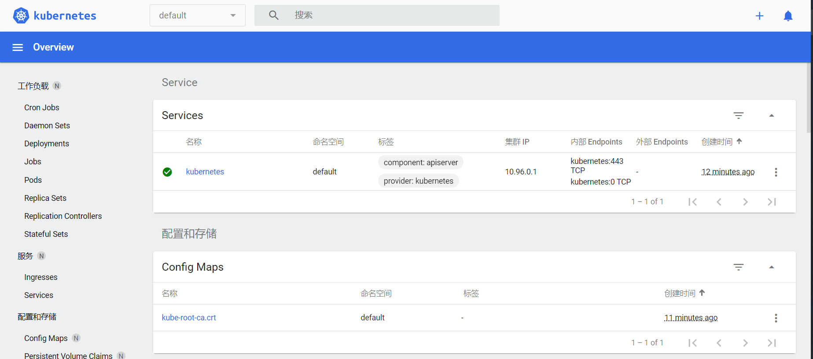
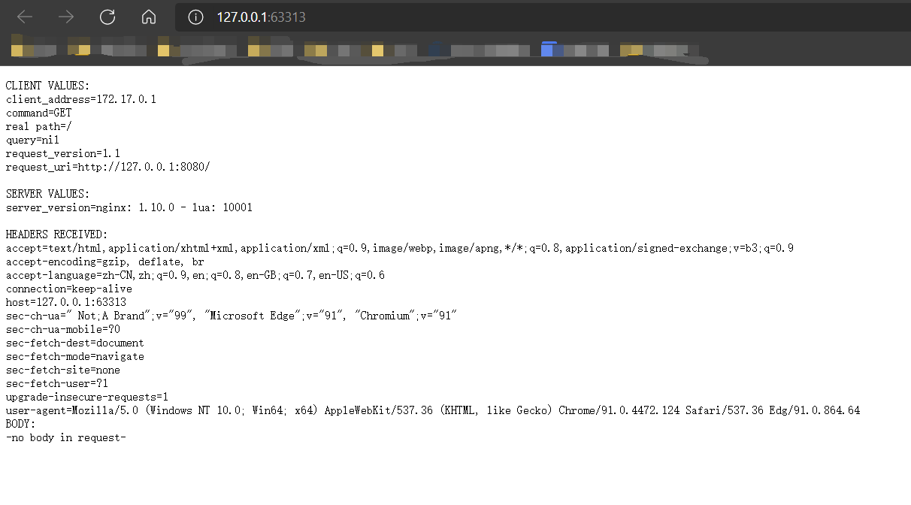
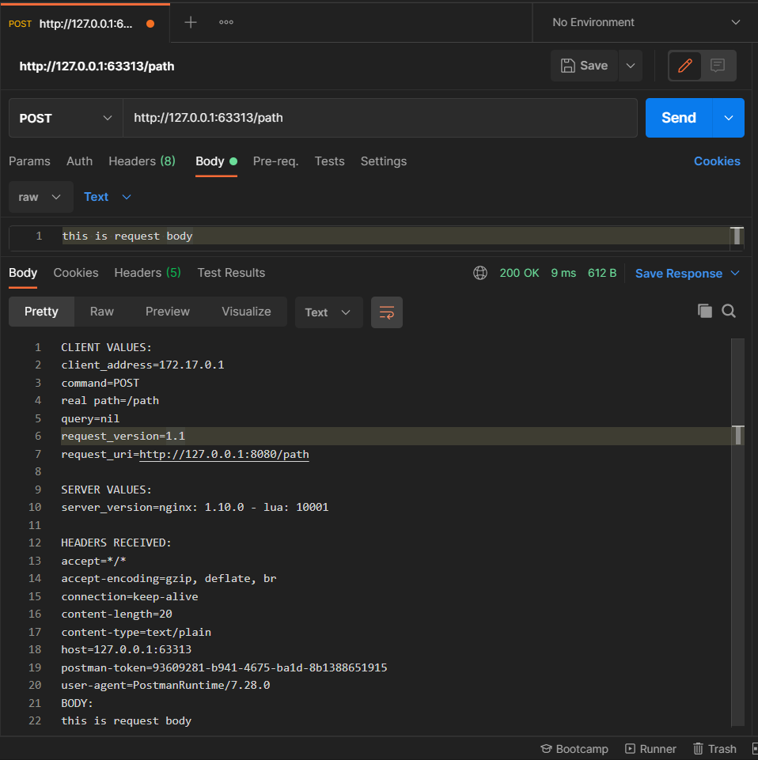

# Kubernetes学习日记（一）

暑期加入了沃天宇老师的实验室进行暑期的实习。在正式开始工作之前，师兄先让我了解一下技术栈，需要了解的有docker、k8s、springboot、springcloud。

谨以一系列博客记录一下自己学习的笔记。更多内容见[Github](https://github.com/SnowPhoenix0105/BackEndLearning)


2021/7/7

## 参考资料

官网：[https://kubernetes.io/](https://kubernetes.io/)

因为官方文档支持中文，并且挺全面的，就先不需要别的资料了。

## 什么是k8s

已经了解了docker这个`容器`的概念，k8s在官网给出的概念就好理解了：

k8s，全称Kubernetes，是一个用于自动部署、扩展和管理容器化应用程序的开源系统。

如果说docker用来构建、运行容器，那么k8s则用来部署和管理容器。

## 基本概念

术语表：[https://kubernetes.io/zh/docs/reference/glossary/](https://kubernetes.io/zh/docs/reference/glossary/)

* `pod`：集群上一组正在运行的容器，是可以在 Kubernetes 中创建和管理的、最小的可部署的计算单元；
* `node`：节点，一台机器；
* `cluster`：集群；
* `controller`：控制器，通过`apiserver`监控集群状态、并致力于将当前状态转换成期望状态的组件；
* `service`：将运行在`pod`上的应用暴露为网络服务；
* `volume`：卷，类似于docker中的volume，但是提供了更丰富的功能，详见[https://kubernetes.io/zh/docs/concepts/storage/volumes/](https://kubernetes.io/zh/docs/concepts/storage/volumes/)；
* 

### k8s组件


* `Control Plane Components`：控制面板，负责检测和响应集群事件，对整个集群做出全局决策（如在某些条件下启动新的pod）；
  * `kube-apiserver`：控制面板的前端，支持水平扩展（部署多个实例）；
  * `etcd`：一个key-value数据库，作为整个集群的数据的后台数据库；
  * `kube-scheduler`：为`pod`分配`node`的调度器；
  * `kube-controller-manager`：一系列控制器的整合，支持水平扩展；
    * `node controller`：节点控制器，节点出现故障时进行通知和响应；
    * `job controller`：监测代表一次性任务的`Job`对象，然后创建`pod`来运行这些任务直至完成；
    * `endpoints controller`：填充端点（Endpoints）对象，即连接`service`与`pod`；
    * `service account & token controllers`：为新的命名空间创建默认帐户和 API 访问令牌；
  * `cloud-controller-manager`：用于和云服务提供商/云平台交互的控制器的集合，支持水平扩展；
    * `node controller`：节点控制器，用于在节点终止响应后检查云提供商以确定节点是否已被删除；
    * `route controller`：路由控制器，用于在云基础架构中设置路由；
    * `service controller`：服务控制器，用于创建、更新和删除云平台的负载均衡；
* `Node Components`：节点组件，在节点上运行的组件，维护`pod`并提供k8s运行环境；
  * `kubelet`：在节点上运行的代理（agent），通过多种方式接收`PodSpecs`并保证其中描述的容器处于运行状态且健康，只管理由k8s创建的容器；
  * `kube-proxy`：在节点上运行的网络代理，维护节点上的网络规则，这些规则允许从集群内部或外部的网络会话与`pod`进行网络通信；
  * `container runtime`：容器的运行时，k8s支持docker、containerd、CRI-O以及任何[Kubernetes CRI](https://github.com/kubernetes/community/blob/master/contributors/devel/sig-node/container-runtime-interface.md)的实现；
* `Addons`：插件，插件通过使用k8s资源，来实现集群工能；
  * `DNS`：和环境中其它DNS服务器一起工作，它为k8s服务提供DNS记录；
  * `dashboard`：仪表盘，是一个基于Web的用户界面，方便进行管理和故障排除；
  * `container resource monitoring`：容器资源监控，将容器的一些常见的时间序列度量值保存到一个记账的数据库，并提供浏览的页面；
  * `cluster-level logging`：集群日志，负责将容器的日志数据保存到一个集中的日志存储中，该存储提供搜索和浏览接口；

### k8s对象

每个k8s对象有两个嵌套的字段：

* `spec`：规约，描述期望状态，创建对象时，由维护人员提供；
* `state`：当前状态，有对象实际情况产生；

k8s的OpenAPI要求请求体中包含JSON格式的spec信息，但是我们使用kebectl时，可以通过yaml文件来描述。以下为官方示例：

application/deployment.yaml

```yaml
apiVersion: apps/v1
kind: Deployment
metadata:
  name: nginx-deployment
spec:
  selector:
    matchLabels:
      app: nginx
  replicas: 2 # tells deployment to run 2 pods matching the template
  template:
    metadata:
      labels:
        app: nginx
    spec:
      containers:
      - name: nginx
        image: nginx:1.14.2
        ports:
        - containerPort: 80
```

其中以下字段是必须的：

* `apiVersion`：所使用的k8s API版本；
* `kind`：所创建的的对象的类别；
* `metadata`： 帮助唯一性标识对象的一些数据，包括一个name字符串、UID和可选的namespace

更多`spec`内容可以参考[Kubernetes API](https://kubernetes.io/docs/reference/generated/kubernetes-api/v1.21/)

#### 标识对象

关于唯一地标识对象，有两种途径，一种是通过`name`，一种是通过`UID`。

`UID`由k8s管理，保证全局唯一。

而对于`name`，两个同类对象不能同时拥有一样的`name`，并且`name`视情况可能需要满足[RFC 1123](https://datatracker.ietf.org/doc/html/rfc1123)中的`DNS subdomain`/`DNS label`的约束，也可能需要满足路径名约束，总的来说，满足下面4个约束就可以满足绝大部分情况：

1. 不多于63个字符;
2. 只能包含小写字母、数字，以及'-';
3. 须以字母/数字开头;
4. 须以字母/数字结尾;

当需要的名字过多的时候，我们可以通过[命名空间](https://kubernetes.io/zh/docs/concepts/overview/working-with-objects/namespaces/)来进行管理。


#### metadata

除了前面提到的name字符串、UID和可选的namespace，metadata还可以保存更多对象信息。

我们也可以通过[标签](https://kubernetes.io/zh/docs/concepts/overview/working-with-objects/labels/)来进行更细致的条件筛选。k8s中，标签是一种key-value结构，我们可以通过判断某个key对应的value是否符合要求来筛选对象。

官方给出了一些标签的示例：

* `"release":"stable"`, `"release":"canary"`
* `"environment":"dev"`, `"environment":"qa"`, `"environment":"production"`
* `"tier":"frontend"`, `"tier":"backend"`, `"tier":"cache"`
* `"partition":"customerA"`, `"partition":"customerB"`
* `"track":"daily"`, `"track":"weekly"`

推荐使用的标签如下：[https://kubernetes.io/zh/docs/concepts/overview/working-with-objects/common-labels/](https://kubernetes.io/zh/docs/concepts/overview/working-with-objects/common-labels/)

而另一种信息是[注解](https://kubernetes.io/zh/docs/concepts/overview/working-with-objects/annotations/)。注解也是一种key-value结构，和标签的表现形式很像，但不同于标签，注解不能用于筛选。

官方给出了使用注解的一些场景：

* 由声明性配置所管理的字段。 将这些字段附加为注解，能够将它们与客户端或服务端设置的默认值、 自动生成的字段以及通过自动调整大小或自动伸缩系统设置的字段区分开来。
* 构建、发布或镜像信息（如时间戳、发布 ID、Git 分支、PR 数量、镜像哈希、仓库地址）。
* 指向日志记录、监控、分析或审计仓库的指针。
* 可用于调试目的的客户端库或工具信息：例如，名称、版本和构建信息。
* 用户或者工具/系统的来源信息，例如来自其他生态系统组件的相关对象的 URL。
* 轻量级上线工具的元数据信息：例如，配置或检查点。
* 负责人员的电话或呼机号码，或指定在何处可以找到该信息的目录条目，如团队网站。
* 从用户到最终运行的指令，以修改行为或使用非标准功能。

相比于将这些信息保存在数据库或文件中，使用注解可以方便开发人员生成用于部署、管理、自检的客户端共享库和工具。


## 安装

安装适合用于学习的minikube：[https://minikube.sigs.k8s.io/docs/start/](https://minikube.sigs.k8s.io/docs/start/)。

minikube是一个单节点的k8s。

然后安装命令行辅助工具kubectl：[https://kubernetes.io/zh/docs/tasks/tools/install-kubectl-windows/](https://kubernetes.io/zh/docs/tasks/tools/install-kubectl-windows/)

这里下载下来的是一个单体的exe，直接放在一个在PATH中的文件夹里就可以了。


## 创建集群

创建并运行一个集群：

```powershell
minikube start
```

获取集群信息：

```powershell
kubectl cluster-info
```

获取节点信息：

```powershell
kubectl get nodes
```

结果如下（将路径等无关信息删去了）：

```powershell
PS D:\xxxx\Learning> minikube start
😄  Microsoft Windows 10 Home China 10.0.19041 Build 19041 上的 minikube v1.21.0
✨  根据现有的配置文件使用 docker 驱动程序
👍  Starting control plane node minikube in cluster minikube
🚜  Pulling base image ...
🏃  Updating the running docker "minikube" container ...
❗  This container is having trouble accessing https://k8s.gcr.io
💡  To pull new external images, you may need to configure a proxy: https://minikube.sigs.k8s.io/docs/reference/networking/proxy/
🐳  正在 Docker 20.10.7 中准备 Kubernetes v1.20.7…
🔎  Verifying Kubernetes components...
    ▪ Using image gcr.io/k8s-minikube/storage-provisioner:v5
🌟  Enabled addons: storage-provisioner, default-storageclass
🏄  Done! kubectl is now configured to use "minikube" cluster and "default" namespace by default    
PS D:\xxxx\Learning> kubectl cluster-info
Kubernetes control plane is running at https://127.0.0.1:57180
KubeDNS is running at https://127.0.0.1:57180/api/v1/namespaces/kube-system/services/kube-dns:dns/proxy

To further debug and diagnose cluster problems, use 'kubectl cluster-info dump'.
PS D:\xxxx\Learning> kubectl get nodes
NAME       STATUS   ROLES    AGE     VERSION
minikube   Ready    <none>   3m51s   v1.20.7
```

启动minikube dashboard：

```powershell
minikube dashboard
```

然后就可以在浏览器访问dashboard了：



## 创建Deployment 

使用如下命令创建一个Deployment：

```powershell
kubectl create deployment hello-node --image=k8s.gcr.io/echoserver:1.4
```

* `hello-node`是这个deployment的名字；
* `--image`指定了创建deployment所使用的镜像；

查看deployment信息：

```powershell
kubectl get deployments
```

查看pod信息：

```powershell
kubectl get pods
```

查看集群事件：

```powershell
kubectl get events
```

查看kubectl配置：

```powershell
kubectl config view
```

结果如下：

```powershell
PS D:\xxxx\Learning> kubectl create deployment hello-node --image=k8s.gcr.io/echoserver:1.4
deployment.apps/hello-node created
PS D:\xxxx\Learning> kubectl get deployments
NAME         READY   UP-TO-DATE   AVAILABLE   AGE
hello-node   0/1     1            0           11s
PS D:\xxxx\Learning> kubectl get pods
hello-node-7567d9fdc9-z879j   0/1     ImagePullBackOff   0          2m41s
PS D:\xxxx\Learning> kubectl get events
LAST SEEN   TYPE      REASON                    OBJECT                             MESSAGE
2m59s       Normal    Scheduled                 pod/hello-node-7567d9fdc9-z879j    Successfully assigned default/hello-node-7567d9fdc9-z879j to minikube
38s         Normal    Pulling                   pod/hello-node-7567d9fdc9-z879j    Pulling image "k8s.gcr.io/echoserver:1.4"
23s         Warning   Failed                    pod/hello-node-7567d9fdc9-z879j    Failed to pull image "k8s.gcr.io/echoserver:1.4": rpc error: code = Unknown desc = Error response from daemon: Get https://k8s.gcr.io/v2/: net/http: request canceled while waiting for connection (Client.Timeout exceeded while awaiting headers)
23s         Warning   Failed                    pod/hello-node-7567d9fdc9-z879j    Error: ErrImagePull
9s          Normal    BackOff                   pod/hello-node-7567d9fdc9-z879j    Back-off pulling 
image "k8s.gcr.io/echoserver:1.4"
9s          Warning   Failed                    pod/hello-node-7567d9fdc9-z879j    Error: ImagePullBackOff
2m59s       Normal    SuccessfulCreate          replicaset/hello-node-7567d9fdc9   Created pod: hello-node-7567d9fdc9-z879j
2m59s       Normal    ScalingReplicaSet         deployment/hello-node              Scaled up replica set hello-node-7567d9fdc9 to 1
19m         Normal    NodeHasSufficientMemory   node/minikube                      Node minikube status is now: NodeHasSufficientMemory
19m         Normal    NodeHasNoDiskPressure     node/minikube                      Node minikube status is now: NodeHasNoDiskPressure
19m         Normal    NodeHasSufficientPID      node/minikube                      Node minikube status is now: NodeHasSufficientPID
19m         Normal    Starting                  node/minikube                      Starting kubelet.19m         Normal    NodeHasSufficientMemory   node/minikube                      Node minikube status is now: NodeHasSufficientMemory
19m         Normal    NodeHasNoDiskPressure     node/minikube                      Node minikube status is now: NodeHasNoDiskPressure
19m         Normal    NodeHasSufficientPID      node/minikube                      Node minikube status is now: NodeHasSufficientPID
19m         Normal    NodeAllocatableEnforced   node/minikube                      Updated Node Allocatable limit across pods
18m         Normal    RegisteredNode            node/minikube                      Node minikube event: Registered Node minikube in Controller
17m         Normal    Starting                  node/minikube                      Starting kube-proxy.
PS D:\xxxx\Learning> kubectl config view
apiVersion: v1
clusters:
- cluster:
    certificate-authority: C:\Users\SnowPhoenix\.minikube\ca.crt
    extensions:
    - extension:
        last-update: Wed, 07 Jul 2021 16:17:25 CST
        provider: minikube.sigs.k8s.io
        version: v1.21.0
      name: cluster_info
    server: https://127.0.0.1:57180
  name: minikube
contexts:
- context:
    cluster: minikube
    extensions:
    - extension:
        last-update: Wed, 07 Jul 2021 16:17:25 CST
        provider: minikube.sigs.k8s.io
        version: v1.21.0
      name: context_info
    namespace: default
    user: minikube
  name: minikube
current-context: minikube
kind: Config
preferences: {}
users:
- name: minikube
  user:
    client-certificate: C:\Users\SnowPhoenix\.minikube\profiles\minikube\client.crt
    client-key: C:\Users\SnowPhoenix\.minikube\profiles\minikube\client.key
```

可以看到，虽然`deployment.apps/hello-node`成功创建了，但是却处于不可用状态，有一个`ImagePullBackOff`报错，从`kubectl get events`中的信息来看，应该是`image pull`失败了。

简单查询了一下，原来是因为国内拉不到`k8s.gcr.io`的镜像。可以通过docker.io的镜像来曲线救国。

先通过镜像拉取镜像：

```powershell
docker pull mirrorgooglecontainers/echoserver:1.4
```

然后通过`docker tag`来“改名”：

```powershell
docker tag docker.io/mirrorgooglecontainers/echoserver:1.4 k8s.gcr.io/echoserver:1.4
```

此时通过`docker images`可以看到`k8s.gcr.io/echoserver:1.4`镜像已经存存在本地仓库中了：

```powershell
PS D:\xxxx\Learning> docker images
REPOSITORY                          TAG         IMAGE ID       CREATED        SIZE
mirrorgooglecontainers/echoserver   1.4         a90209bb39e3   5 years ago    140MB
k8s.gcr.io/echoserver               1.4         a90209bb39e3   5 years ago    140MB
```

然后再删除原先的deployment：

```powershell
kubectl delete deployment hello-node
```

然后再重新执行之前的步骤，发现还是不行。重启之后还是不行，就算docker仓库中已经有这个镜像了，启动pods的时候还是会尝试pull。所以只好干脆创建pods的时候就使用镜像：

```powershell
kubectl create deployment hello-node --image=mirrorgooglecontainers/echoserver:1.4
```

## 创建Service

默认情况下，pod只能通过集群中的内部IP地址访问。 要使得hello-node容器可以从k8s虚拟网络的外部访问，我们需要将pod暴露为service。

```powershell
kubectl expose deployment hello-node --type=LoadBalancer --port=8080
```

通过以下命令可以查看service的添加情况：

```powershell
kubectl get services
```

其中`services`可以简写为`svc`。

```powershell
PS D:\xxx\Learning> kubectl get services
NAME         TYPE           CLUSTER-IP      EXTERNAL-IP   PORT(S)          AGE
hello-node   LoadBalancer   10.109.78.212   <pending>     8080:32610/TCP   11s
kubernetes   ClusterIP      10.96.0.1       <none>        443/TCP          3h32m
```

可以看到我们添加了名为`hello-node`、类型为`LoadBalancer`（负载均衡器）的服务，并且映射到了宿主机端口8080。但是此时访问`localhost:8080`并不能访问到，还需要执行命令：

```powershell
minikube service hello-node
```

我们可以看到命令行输出如下信息：

```powershell
|-----------|------------|-------------|---------------------------|
| NAMESPACE |    NAME    | TARGET PORT |            URL            |
|-----------|------------|-------------|---------------------------|
| default   | hello-node |        8080 | http://192.168.49.2:32610 |
|-----------|------------|-------------|---------------------------|
🏃  Starting tunnel for service hello-node.
|-----------|------------|-------------|------------------------|
| NAMESPACE |    NAME    | TARGET PORT |          URL           |
|-----------|------------|-------------|------------------------|
| default   | hello-node |             | http://127.0.0.1:63313 |
|-----------|------------|-------------|------------------------|
🎉  正通过默认浏览器打开服务 default/hello-node...
❗  Because you are using a Docker driver on windows, the terminal needs to be open to run it.
```

访问`http://127.0.0.1:63313`可以看到，返回了我们所发送的请求的信息：



通过PostMan，我们可以发送其它的信息，也都从响应体中拿到了echo的结果：



## 启动插件

列出当前支持的插件：

```powershell
minikube addons list
```

可以发现有些插件已经启动了：

```powershell
|-----------------------------|----------|--------------|
|         ADDON NAME          | PROFILE  |    STATUS    |
|-----------------------------|----------|--------------|
| ambassador                  | minikube | disabled     |
| auto-pause                  | minikube | disabled     |
| csi-hostpath-driver         | minikube | disabled     |
| dashboard                   | minikube | enabled ✅   | 
| default-storageclass        | minikube | enabled ✅   | 
| efk                         | minikube | disabled     |
| freshpod                    | minikube | disabled     |
| gcp-auth                    | minikube | disabled     |
| gvisor                      | minikube | disabled     |
| helm-tiller                 | minikube | disabled     |
| ingress                     | minikube | disabled     |
| ingress-dns                 | minikube | disabled     |
| istio                       | minikube | disabled     |
| istio-provisioner           | minikube | disabled     |
| kubevirt                    | minikube | disabled     |
| logviewer                   | minikube | disabled     |
| metallb                     | minikube | disabled     |
| metrics-server              | minikube | disabled     |
| nvidia-driver-installer     | minikube | disabled     |
| nvidia-gpu-device-plugin    | minikube | disabled     |
| olm                         | minikube | disabled     |
| pod-security-policy         | minikube | disabled     |
| registry                    | minikube | disabled     |
| registry-aliases            | minikube | disabled     |
| registry-creds              | minikube | disabled     |
| storage-provisioner         | minikube | enabled ✅   | 
| storage-provisioner-gluster | minikube | disabled     |
| volumesnapshots             | minikube | disabled     |
|-----------------------------|----------|--------------|
```

启动插件`metrics-server`：

```powershell
minikube addons enable metrics-server
```


## 清理资源

关闭插件`metrics-server`

```powershell
minikube addons disable metrics-server
```

删除服务

```powershell
kubectl delete service hello-node
```


删除deployment

```powershell
kubectl delete deployment hello-node
```


停止minikube虚拟机

```powershell
minikube stop
```


删除minikube虚拟机

```powershell
minikube delete
```


## 小结

今天，我们了解了一些k8s的基本概念，并且尝试进行了一次部署，并成功进行了访问。
