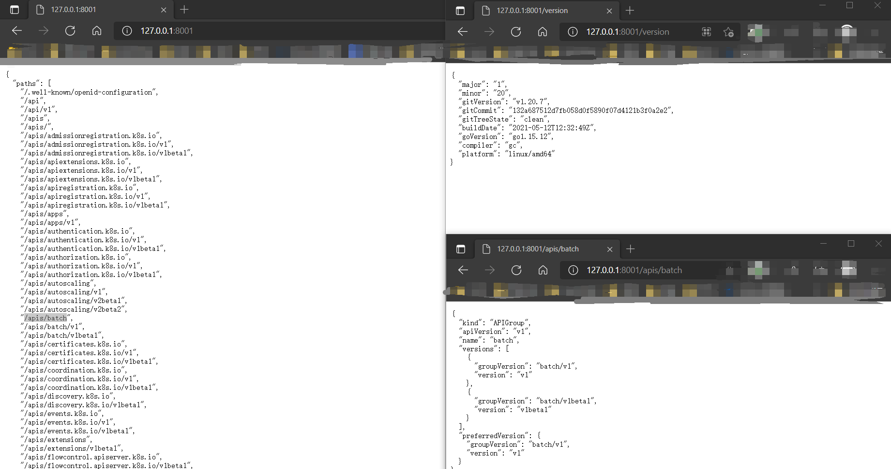

# Kubernetes学习日记（一）

暑期加入了沃天宇老师的实验室进行暑期的实习。在正式开始工作之前，师兄先让我了解一下技术栈，需要了解的有docker、k8s、springboot、springcloud。

谨以一系列博客记录一下自己学习的笔记。更多内容见[Github](https://github.com/SnowPhoenix0105/BackEndLearning)


2021/7/7

## 部署应用

用minikube启动集群，然后用kubectl打开dashboard后，创建应用：

```powershell
kubectl create deployment kubernetes-bootcamp --image=gcr.io/google-samples/kubernetes-bootcamp:v1
```

跟上次一样，无法获取镜像，在dockerhub上换个镜像：

```powershell
kubectl create deployment kubernetes-bootcamp --image=hhitzhl/kubernetes-bootcamp
```

可以从dashboard看到已经成功启动了（kubectl get pods也可以）。

此时，集群中的机器都运行在一个私有的、隔离的网络中，为了将其暴露出来，我们打开一个新的终端，使用以下工具：

```powershell
kubectl proxy
```

该工具启动了一个服务，将集群和主机之间的通信进行转发，从控制台输出的信息中得知其服务位于`127.0.0.1:8001`。

用浏览器进行访问（注意，不是localhost），可以看到这里列出了所有可以访问的url，随便打开了几个，都获得了结果：



通过dashboard或者`kubectl get pods`获取到pods的`NAME`属性，然后通过访问以下地址获取它的详细信息：

```
http://127.0.0.1:8001/api/v1/namespaces/default/pods/${NAME}
```

注意把`${NAME}`替换为pods的`NAME`。

```JSON
{
  "kind": "Pod",
  "apiVersion": "v1",
  "metadata": {
    "name": "kubernetes-bootcamp-69b8fbf65b-s245b",
    "generateName": "kubernetes-bootcamp-69b8fbf65b-",
    "namespace": "default",
    "uid": "6d4c1f4b-6f5f-4039-8115-95083b2e9db2",
    "resourceVersion": "1855",
    "creationTimestamp": "2021-07-11T08:33:35Z",
    "labels": {
      "app": "kubernetes-bootcamp",
      "pod-template-hash": "69b8fbf65b"
    },
    "ownerReferences": [
      {
        "apiVersion": "apps/v1",
        "kind": "ReplicaSet",
        "name": "kubernetes-bootcamp-69b8fbf65b",
        "uid": "766d5f6c-9b2e-4895-a9d6-ccd3c9462389",
        "controller": true,
        "blockOwnerDeletion": true
      }
    ],
    "managedFields": [
      {
        "manager": "kube-controller-manager",
        "operation": "Update",
        "apiVersion": "v1",
        "time": "2021-07-11T08:33:35Z",
        "fieldsType": "FieldsV1",
        "fieldsV1": {"f:metadata":{"f:generateName":{},"f:labels":{".":{},"f:app":{},"f:pod-template-hash":{}},"f:ownerReferences":{".":{},"k:{\"uid\":\"766d5f6c-9b2e-4895-a9d6-ccd3c9462389\"}":{".":{},"f:apiVersion":{},"f:blockOwnerDeletion":{},"f:controller":{},"f:kind":{},"f:name":{},"f:uid":{}}}},"f:spec":{"f:containers":{"k:{\"name\":\"kubernetes-bootcamp\"}":{".":{},"f:image":{},"f:imagePullPolicy":{},"f:name":{},"f:resources":{},"f:terminationMessagePath":{},"f:terminationMessagePolicy":{}}},"f:dnsPolicy":{},"f:enableServiceLinks":{},"f:restartPolicy":{},"f:schedulerName":{},"f:securityContext":{},"f:terminationGracePeriodSeconds":{}}}
      },
      {
        "manager": "kubelet",
        "operation": "Update",
        "apiVersion": "v1",
        "time": "2021-07-11T08:34:01Z",
        "fieldsType": "FieldsV1",
        "fieldsV1": {"f:status":{"f:conditions":{"k:{\"type\":\"ContainersReady\"}":{".":{},"f:lastProbeTime":{},"f:lastTransitionTime":{},"f:status":{},"f:type":{}},"k:{\"type\":\"Initialized\"}":{".":{},"f:lastProbeTime":{},"f:lastTransitionTime":{},"f:status":{},"f:type":{}},"k:{\"type\":\"Ready\"}":{".":{},"f:lastProbeTime":{},"f:lastTransitionTime":{},"f:status":{},"f:type":{}}},"f:containerStatuses":{},"f:hostIP":{},"f:phase":{},"f:podIP":{},"f:podIPs":{".":{},"k:{\"ip\":\"172.17.0.6\"}":{".":{},"f:ip":{}}},"f:startTime":{}}}
      }
    ]
  },
  "spec": {
    "volumes": [
      {
        "name": "default-token-klcvh",
        "secret": {
          "secretName": "default-token-klcvh",
          "defaultMode": 420
        }
      }
    ],
    "containers": [
      {
        "name": "kubernetes-bootcamp",
        "image": "hhitzhl/kubernetes-bootcamp",
        "resources": {
          
        },
        "volumeMounts": [
          {
            "name": "default-token-klcvh",
            "readOnly": true,
            "mountPath": "/var/run/secrets/kubernetes.io/serviceaccount"
          }
        ],
        "terminationMessagePath": "/dev/termination-log",
        "terminationMessagePolicy": "File",
        "imagePullPolicy": "Always"
      }
    ],
    "restartPolicy": "Always",
    "terminationGracePeriodSeconds": 30,
    "dnsPolicy": "ClusterFirst",
    "serviceAccountName": "default",
    "serviceAccount": "default",
    "nodeName": "minikube",
    "securityContext": {
      
    },
    "schedulerName": "default-scheduler",
    "tolerations": [
      {
        "key": "node.kubernetes.io/not-ready",
        "operator": "Exists",
        "effect": "NoExecute",
        "tolerationSeconds": 300
      },
      {
        "key": "node.kubernetes.io/unreachable",
        "operator": "Exists",
        "effect": "NoExecute",
        "tolerationSeconds": 300
      }
    ],
    "priority": 0,
    "enableServiceLinks": true,
    "preemptionPolicy": "PreemptLowerPriority"
  },
  "status": {
    "phase": "Running",
    "conditions": [
      {
        "type": "Initialized",
        "status": "True",
        "lastProbeTime": null,
        "lastTransitionTime": "2021-07-11T08:33:35Z"
      },
      {
        "type": "Ready",
        "status": "True",
        "lastProbeTime": null,
        "lastTransitionTime": "2021-07-11T08:34:01Z"
      },
      {
        "type": "ContainersReady",
        "status": "True",
        "lastProbeTime": null,
        "lastTransitionTime": "2021-07-11T08:34:01Z"
      },
      {
        "type": "PodScheduled",
        "status": "True",
        "lastProbeTime": null,
        "lastTransitionTime": "2021-07-11T08:33:35Z"
      }
    ],
    "hostIP": "192.168.49.2",
    "podIP": "172.17.0.6",
    "podIPs": [
      {
        "ip": "172.17.0.6"
      }
    ],
    "startTime": "2021-07-11T08:33:35Z",
    "containerStatuses": [
      {
        "name": "kubernetes-bootcamp",
        "state": {
          "running": {
            "startedAt": "2021-07-11T08:34:01Z"
          }
        },
        "lastState": {
          
        },
        "ready": true,
        "restartCount": 0,
        "image": "hhitzhl/kubernetes-bootcamp:latest",
        "imageID": "docker-pullable://hhitzhl/kubernetes-bootcamp@sha256:1214cd7a1ad192e92505aa2162e84da00bed459b27fb840d51832ac111f7e641",
        "containerID": "docker://b62f33fec376e8ae17d3299553dc0d7eca0dd34b7d39344e9cadd160629d3136",
        "started": true
      }
    ],
    "qosClass": "BestEffort"
  }
}
```

我们不仅可以看到这个pod的metadata，还有其spec（规约）和status，我们之前的学习知道它们分别代表了pod的期望状态和实际状态。


