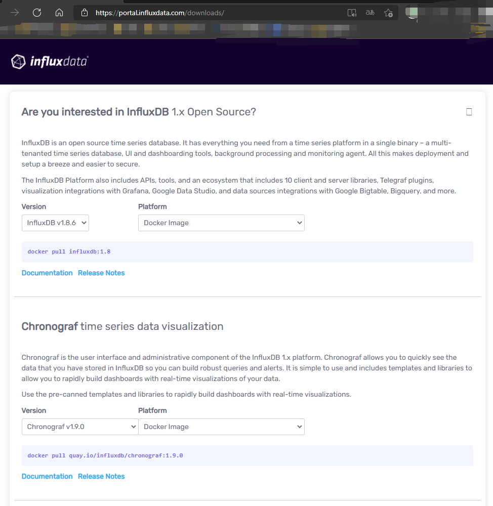
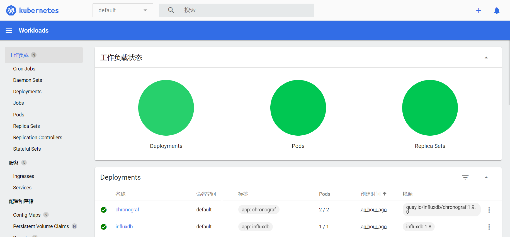
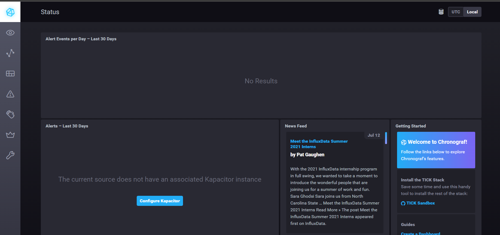

# Kubernetes学习日记（三）

暑期加入了沃天宇老师的实验室进行暑期的实习。在正式开始工作之前，师兄先让我了解一下技术栈，需要了解的有docker、k8s、springboot、springcloud。

谨以一系列博客记录一下自己学习的笔记。更多内容见[Github](https://github.com/SnowPhoenix0105/BackEndLearning)


2021/7/13

今天师兄让我尝试写一下Chronograf的配置文件。

## 参考资料

* Chronograf官方文档：[https://docs.influxdata.com/chronograf/latest/](https://docs.influxdata.com/chronograf/latest/)
* Kuberbetes API文档：[https://kubernetes.io/docs/reference/generated/kubernetes-api/v1.21/](https://kubernetes.io/docs/reference/generated/kubernetes-api/v1.21/)


## Chronograf是什么


Chronograf是InfluxData中的可视化Web服务，InfluxData常常用于监控一个集群，监控的信息保存于influxdb数据库，而chronograf的功能就是将influxdb中的数据漂亮地展示出来。


## 镜像

`InfluxDB 2.0`似乎已经推出了，但是`Chronograf`似乎目前只支持`InfluxDB 1.x`。

下载页：[https://portal.influxdata.com/downloads/](https://portal.influxdata.com/downloads/)

往下翻，可以看到`InfluxDB 1.x`和`Chronograf`的下载链接，可以看到这里直接就提供了docker镜像，所以我们不需要手动构建镜像了：



```powershell
docker pull influxdb:1.8
docker pull quay.io/influxdb/chronograf:1.9.0
```

## 配置的参数选择

从[Chronograf文档 | --port](https://docs.influxdata.com/chronograf/v1.9/administration/config-options/#--port)中可以知道，其默认的端口是`8888`，可以通过命令行参数/环境变量来修改，但是次数参数来修改deploy就启动不了了，所以还是通过环境变量来修改。

另一个比较重要的参数时InfluxDb的信息，从[Chronograf文档 | --influxdb-url](https://docs.influxdata.com/chronograf/v1.9/administration/config-options/#--influxdb-url)中可以知道，可以通过环境变量`INFLUXDB_URL`来指定，如果我们将InfluxDb也包装为一个Service，那么我们就可以借助k8s内部的DNS来访问了。在文档中，后面也介绍了influxdb需要鉴权时的参数，需要的话，以后再加上，届时，可能需要[k8s Secret](https://kubernetes.io/zh/docs/tasks/configmap-secret/managing-secret-using-kubectl/)来保证其安全性。

从[InfluxDb文档 | Port](https://docs.influxdata.com/influxdb/v1.8/administration/ports/)中可以知道，FluxDb响应HTTP请求的服务默认启动于8086端口，这里我们就不修改了。

## 配置文件构造

详见[chronograf](../chronograf/)

chronograf.yml
```yml
apiVersion: apps/v1
kind: Deployment
metadata:
  name: chronograf
  namespace: default
  labels:
    app: chronograf
spec:
  selector:
    matchLabels:
      app: chronograf
  replicas: 2
  template:
    metadata:
      labels:
        app: chronograf
    spec:
      containers:
      - name: chronograf
        image: quay.io/influxdb/chronograf:1.9.0
        # args:
        # - --influxdb-url=influxdb:8086
        imagePullPolicy: IfNotPresent
        env:
        - name: PORT
          value: "8081"
        - name: INFLUXDB_URL
          value: "http://influxdb:8086"
        resources:
          limits:
            cpu: 100m
            memory: 200Mi
        ports:
        - containerPort: 8081
```

resources.limits是我随便写的，因为不写vscode会报warning。

通过指定`imagePullPolicy: IfNotPresent`，使得本地有镜像的时候不必重新拉取。

通过指定了`PORT`和`INFLUXDB_URL`两个环境变量，分别实现了更改端口、指定influxdb的url，然后将容器的8081端口暴露出来。

其中influxdb的url我们利用了k8s的DNS，我们后面还需要创建一个influxdb的Service。

然后创建一个服务：

chronograf-service.yml
```yml
apiVersion: v1
kind: Service
metadata:
  name: chronograf-service
  namespace: default
  labels:
    app: chronograf-service
spec:
  selector:
    app: chronograf
  type: NodePort 
  ports: 
  - port: 8081
```

通过`selector`来指定pods。这跟使用`kubectl expose pod/chronograf --type="NodePort" --port=8081`的效果应该差不多。

最后创建influxdb：

influxdb.yml
```yml
apiVersion: apps/v1
kind: Deployment
metadata:
  name: influxdb
  namespace: default
  labels:
    app: influxdb
spec:
  selector:
    matchLabels:
      app: influxdb
  replicas: 1
  template:
    metadata:
      labels:
        app: influxdb
    spec:
      containers:
      - name: influxdb
        imagePullPolicy: IfNotPresent
        image: influxdb:1.8
        resources:
          limits:
            cpu: 100m
            memory: 200Mi
        ports:
        - containerPort: 8086
```

influxdb的service就直接通过`kubectl expose`来创建。

## 运行

通过`kubectl apply`运行这三个配置文件，通过`kubectl expose`来创建influxdb的service。

通过dashboard可以看到都正常运行了：



因为我在windows上运行，还需要将minikube这个node的端口转发出来：

```powershell
minikube service chronograf-service
```



注意，如果我们没有配置`INFLUXDB_URL`环境变量，访问的时候就必须先输入连接InfluxDb的信息，如果仅仅创建了InfluxDb的Deployment，而没有创建Service，在Chronograf中应该会报错无法连接到InfluxDb。


## 总结

通过查阅文档，我们初步完成了一个Chronograf的相关配置文件。

