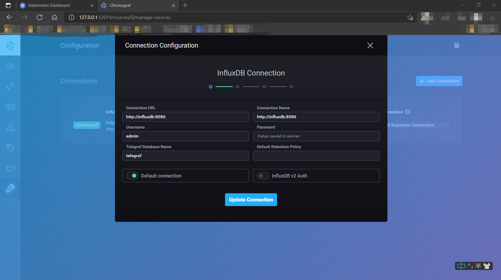

# Kubernetes学习日记（四）

暑期加入了沃天宇老师的实验室进行暑期的实习。在正式开始工作之前，师兄先让我了解一下技术栈，需要了解的有docker、k8s、springboot、springcloud。

谨以一系列博客记录一下自己学习的笔记。更多内容见[Github](https://github.com/SnowPhoenix0105/BackEndLearning)


2021/7/18

上一次写的Chronograf的配置文件存在一些问题，今天来改进一下。

## 梳理

### 存在的问题

1. 在控制面板中查看到chronograf已经`READY`了，但是实际上仍旧不能访问，需要等待一会儿；
2. 连接influxdb没有鉴权相关的配置；

### 解决方案

第一个问题通过探针来解决，第二个问题通过Secret来添加相关的配置。

### 资料

* k8s官方文档——容器探针 [https://kubernetes.io/docs/concepts/workloads/pods/pod-lifecycle/#container-probes](https://kubernetes.io/docs/concepts/workloads/pods/pod-lifecycle/#container-probes)
* k8s官方文档——API参考 [https://kubernetes.io/docs/reference/generated/kubernetes-api/v1.21/](https://kubernetes.io/docs/reference/generated/kubernetes-api/v1.21/)
* k8s官方文档——任务：管理Secrets [https://kubernetes.io/zh/docs/tasks/configmap-secret/](https://kubernetes.io/zh/docs/tasks/configmap-secret/)


## 探针

探针是针对容器的，对于每个容器，可以指定一系列探针来探测容器的状态。

### 探测方式

一共有三种探测方式：

1. TCP连接，通过向指定的IP和端口发起TCP连接，如果连接成功，则本次探测成功；
2. HTTP请求，通过向指定的IP、端口、路径发送GET请求，如果获得了在`[200, 400)`区间内的状态码，则本次探测成功；
3. EXEC，通过执行一定的指令，如果指令成功执行（退出码为0），则本次探测成功；

最后一种是最灵活的，但是需要在配置文件中写命令行指令，不是很美观，也更容易出错。

### 探测结果与容器状态的关系

有时容器会处于临时的波动状态，后续会自动恢复，此时如果探测失败，如果直接判定容器处于不可用状态可能将其重启，这是得不偿失的。

在探针（[Probe ](https://kubernetes.io/docs/reference/generated/kubernetes-api/v1.21/#probe-v1-core)）的API中，有两个字段可以进行配置：

* failureThreshold
* successThreshold

它们都是整数值，当连续`failureThreshold`次探测失败时，判定容器失效；当连续`successThreshold`次探测成功时，判定容器有效。

它们最小值都是1，前者默认值为3，后者默认值为1。

### 探针类别

一共有三种探针，每种探针都可以使用上面提到的三种探测方式（事实上，在API参考中，这三种探针的对象都是同一个类的）。

1. `livenessProbe`（存活探针）：用于探测容器是否存活，当该探针判定容器失效时，kubelet将关闭容器并进入重启程序；
2. `readinessProbe`（就绪探针）：用于探测容器是否就绪，是否可以向外提供服务，当该探针判定容器失效时，`endpoints controller`会将所有与这个容器关联的Service中将该容器的IP项删去，即流量不会通过Service路由到这个容器；
3. `startupProbe`（启动探针）：在该探针宣布判定容器有效前，所有其它探针都不会生效，当该探针宣布容器失效时，kubelet将关闭容器并进入重启程序；

当我们需要对流量进行控制的时候，我们使用`readinessProbe`；当我们需要主动帮助容器crash的时候，我们使用`livenessProbe`（如果容器陷入不可用状态会自动crash，就不需要这个探针）；当容器启动后需要很长一段时间才可以提供服务的时候，我们使用`startupProbe`。

## 为Chronograf配置文件添加探针

目前的配置存在的问题主要是容器还处于加载状态的时候，就已经显示为READY状态了。一般情况下不会有什么问题，但是当我们滚动更新的时候，k8s首先启动新的容器，当新的容器READY的时候，就会关闭一个旧的容器，但此时实际上新的容器还不可以使用，这个时候访问就可能发生错误，所以我们需要推迟READY的时间。

原先的样子：

```yaml
apiVersion: apps/v1
kind: Deployment
metadata:
  name: chronograf
  namespace: default
  labels:
    app: chronograf
spec:
  selector:
    matchLabels:
      app: chronograf
  replicas: 2
  template:
    metadata:
      labels:
        app: chronograf
    spec:
      containers:
      - name: chronograf
        image: quay.io/influxdb/chronograf:1.9.0
        # args:
        # - --influxdb-url=influxdb:8086
        imagePullPolicy: IfNotPresent
        env:
        # - name: PORT
        #   value: "8081"
        - name: INFLUXDB_URL
          value: "http://influxdb:8086"
        resources:
          limits:
            cpu: 100m
            memory: 200Mi
        ports:
        - containerPort: 8888
```

这里我还是将其改回了默认端口，毕竟没有端口冲突，没必要修改。

```yaml
apiVersion: apps/v1
kind: Deployment
metadata:
  name: chronograf
  namespace: default
  labels:
    app: chronograf
spec:
  selector:
    matchLabels:
      app: chronograf
  replicas: 2
  template:
    metadata:
      labels:
        app: chronograf
    spec:
      containers:
      - name: chronograf
        image: quay.io/influxdb/chronograf:1.9.0
        # args:
        # - --influxdb-url=influxdb:8086
        imagePullPolicy: IfNotPresent
        env:
        # - name: PORT
        #   value: "8081"
        - name: INFLUXDB_URL
          value: "http://influxdb:8086"
        resources:
          limits:
            cpu: 100m
            memory: 200Mi
        ports:
        - containerPort: 8888
        startupProbe:
          httpGet:
            scheme: HTTP
            port: 8888
            path: /
          initialDelaySeconds: 60
          periodSeconds: 10
          successThreshold: 1
          failureThreshold: 30
```

因为目前存在的问题是启动时的问题，所以主要是添加了启动的探针，容器启动60s后开始探测，每10s发送一次GET请求，如果连续30次请求都没有成功，那么就重启，即如果6min仍没能够成功启动，那么就会重启。

实验一下（有一些我之前没关的）：

```powershell
PS D:\xxx\Learning\k8s\chronograf> kubectl get pods
NAME                                   READY   STATUS    RESTARTS   AGE
chronograf-84695d4bd9-2ljt2            0/1     Running   0          2m5s
chronograf-84695d4bd9-2psmf            0/1     Running   0          2m5s
influxdb-564b6d9885-6btvw              1/1     Running   2          4d16h
kubernetes-bootcamp-69b8fbf65b-b66p8   1/1     Running   3          6d14h
kubernetes-bootcamp-69b8fbf65b-cncrl   1/1     Running   3          6d14h
kubernetes-bootcamp-69b8fbf65b-n8fgr   1/1     Running   3          6d14h
kubernetes-bootcamp-69b8fbf65b-wn8sq   1/1     Running   3          6d14h
PS D:\xxxx\Learning\k8s\chronograf> kubectl get pods
NAME                                   READY   STATUS    RESTARTS   AGE
chronograf-84695d4bd9-2ljt2            0/1     Running   0          2m15s
chronograf-84695d4bd9-2psmf            1/1     Running   0          2m15s
influxdb-564b6d9885-6btvw              1/1     Running   2          4d16h
kubernetes-bootcamp-69b8fbf65b-b66p8   1/1     Running   3          6d14h
kubernetes-bootcamp-69b8fbf65b-cncrl   1/1     Running   3          6d14h
kubernetes-bootcamp-69b8fbf65b-n8fgr   1/1     Running   3          6d14h
kubernetes-bootcamp-69b8fbf65b-wn8sq   1/1     Running   3          6d14h
```

可以看见2min后开始陆续进入就绪状态，此时`chronograf-service`确实是可用的。


## InfluxDb鉴权

从[InfluxDb文档 | 授权与鉴权](https://docs.influxdata.com/influxdb/v1.8/administration/authentication_and_authorization/)中可以看到，要为InfluxDb开启鉴权，需要两个条件：

1. 创建admin用户；
2. 将`auth-enabled`选项设置为`true`；

通过[InfluxDb文档 | 配置 #auth-enabled--false](https://docs.influxdata.com/influxdb/v1.8/administration/config/#auth-enabled--false)可以知道，后者可以通过环境变量来设置。

一般来说，数据库中的内容应该是持久化的，应该利用volume来保存数据，所以通过container的command参数来添加用户不太妥当，还是手动来添加用户。

在[influxdb.yaml](../chronograf/influxdb.yaml)中container中添加环境变量：`INFLUXDB_HTTP_AUTH_ENABLED`，值为`"true"`，注意`true`是YAML格式中的布尔类型，而环境变量需要的是字符串类型，需要通过双引号来转义：

```yaml
apiVersion: apps/v1
kind: Deployment
metadata:
  name: influxdb
  namespace: default
  labels:
    app: influxdb
spec:
  selector:
    matchLabels:
      app: influxdb
  replicas: 1
  template:
    metadata:
      labels:
        app: influxdb
    spec:
      containers:
      - name: influxdb
        imagePullPolicy: IfNotPresent
        image: influxdb:1.8
        env:
        - name: INFLUXDB_HTTP_AUTH_ENABLED
          value: "true"
        resources:
          limits:
            cpu: 100m
            memory: 200Mi
        ports:
        - containerPort: 8086
```

因为我们关注的主要是chronograf，所以就先不为其配置volume了。

`kubectl apply -f influxdb.yaml`后，通过`kubectl exec -it po/<INFLUXDB_POD_NAME> -- bash`进入容器，参照[InfluxDb文档 | 用户管理命令](https://docs.influxdata.com/influxdb/v1.8/administration/authentication_and_authorization/#user-management-commands)，创建好admin用户。

```powershell
PS D:\xxx\Learning\k8s\chronograf> kubectl exec -it po/influxdb-5f7d9c65f9-9sd7s 
-- bash
root@influxdb-5f7d9c65f9-9sd7s:/# influx 
Connected to http://localhost:8086 version 1.8.6
InfluxDB shell version: 1.8.6
> create user admin with password 'password' with all privileges
> exit
root@influxdb-5f7d9c65f9-9sd7s:/# exit
exit
```

## 创建Secret

```yaml
apiVersion: apps/v1
kind: Secret
metadata:
  name: chronograf-secret
type: Opaque
stringData:
  username: admin
  password: password
```

这里直接使用了`stringData`而不是`data`，这样可以直接写，而不需要base64转码一遍，虽然转码一遍更安全一些（感觉也没啥用，毕竟base64并不是个加密算法）。可能最安全的还是直接在命令行创建Secret：

```powershell
kubectl create secret generic chronograf-secret --from-literal=username='admin' --from-literal=password='password'
```

## 为Chronograf添加相应的环境变量

container的env部分改成如下：

```yaml
env:
# - name: PORT
#   value: "8081"
- name: INFLUXDB_URL
    value: "http://influxdb:8086"
- name: INFLUXDB_USERNAME
    valueFrom: 
    secretKeyRef:
        name: chronograf-secret
        key: username
- name: INFLUXDB_PASSWORD
    valueFrom: 
    secretKeyRef:
        name: chronograf-secret
        key: password
```

`kubectl apply -f chronograf.yaml`，等待就绪后，通过`minikube service chronograf-service`进行访问，可以看到生效了：




## 总结

我们使用探针，为Chronograf的状态提供了更定制化的检测方案，通过`startupProbe`让其启动后未准备完成时不为READY状态，使得滚动更新的时候不会出现无法访问的情况。

我们使用Secret为Chronograf配置了用户和密码，使得有权限控制时可以正确访问InfluxDb数据库。
